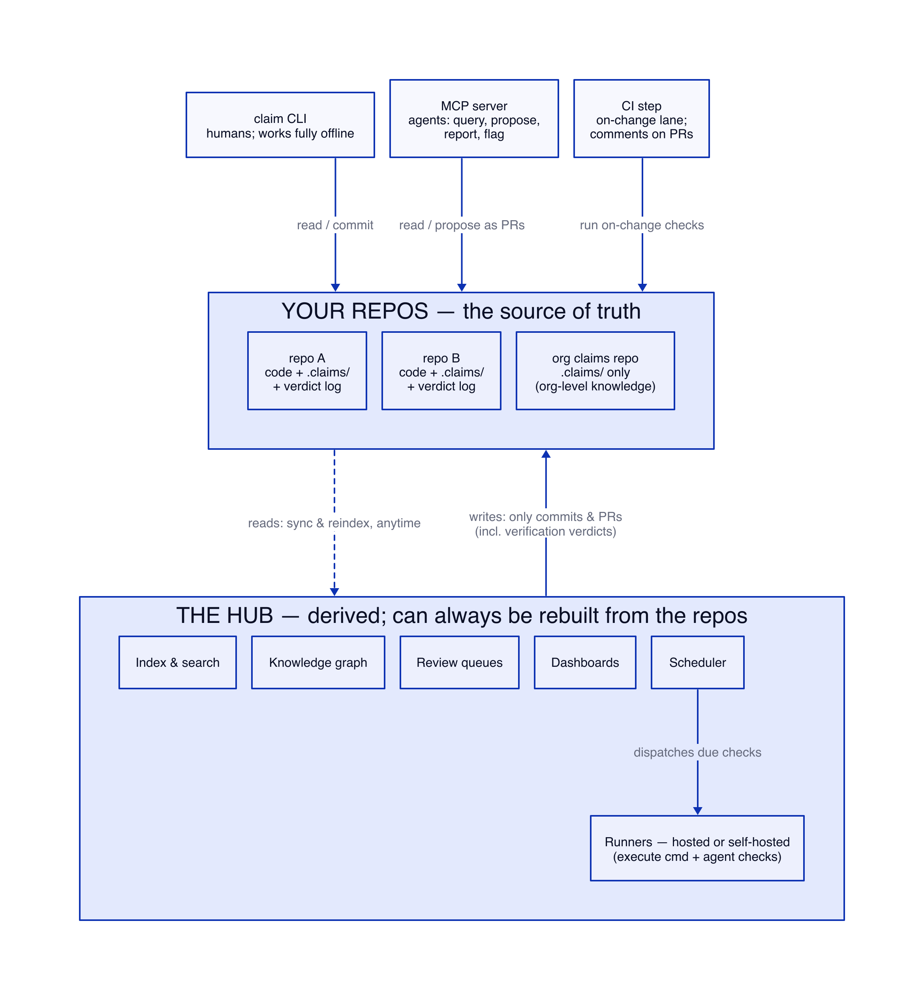
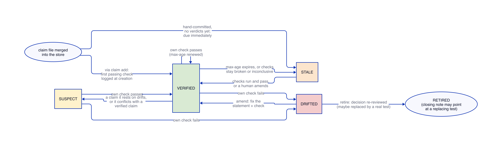
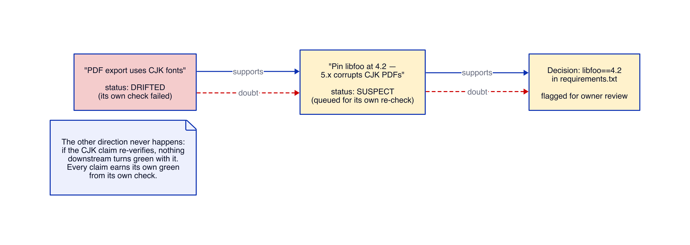
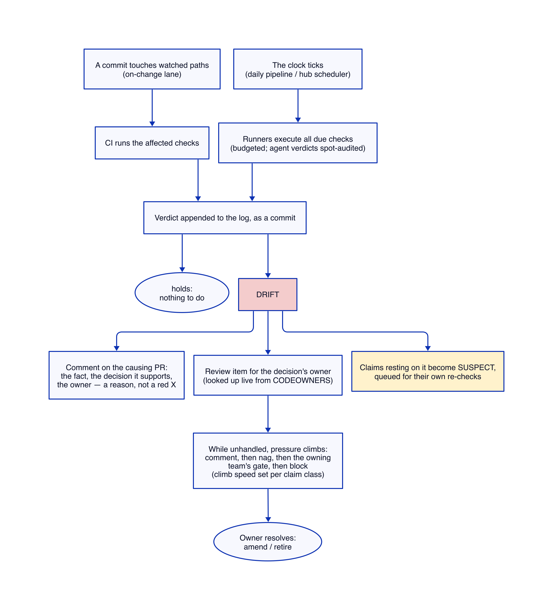

# Claim — product and architecture

Draft v0.5, July 2026. Builds on PROPOSAL.md (the problem and why nothing
solves it) and SPEC.md (the original design notes). This document defines the
product: what it does, what its pieces are, and how it works.

Decisions locked in before writing: the unit of knowledge is called a
**claim**. The open format, CLI, and MCP server work standalone forever, with
a central service on top (the git/GitHub model). Version 1 covers
**engineering knowledge** — repos, builds, dependencies, agent context,
engineering decisions — with company-wide sources added later as opt-in
connectors. Claims are connected in a **typed knowledge graph**.

---

## 1. What this is

A shared brain for the agents and people in an engineering organization,
with one property no other memory system has: **it checks what it knows.**

Every claim in the system is a plain-language statement plus a way to
re-verify it. Some are re-checked by a command, some by an agent sent to
investigate, some by a scheduled human look. Every claim shows when it was
last verified, by whom, and with what evidence. When a claim stops being
true, the system notices, flags everything that depended on it, and puts it
in front of the person who owns the decision it supports.

The relationship between the pieces is the same as git and GitHub:

- **Claim files** are like git repos: plain text, in your repos, fully
  usable with just the CLI, no service required.
- **The hub** is like GitHub: a service layered on top that adds sync,
  org-wide search, the knowledge graph, scheduled verification, review
  queues, and a web UI. It never owns the data. It can be rebuilt from the
  repos at any time.

Agents read from it at the start of a session instead of re-deriving the
world from scratch. They write to it when they learn something durable.
Humans see, in one place, what the agent workforce currently believes, what
that belief rests on, and what has stopped being true.

## 2. The shape of the system



Three layers. Each one works without the ones after it.

**Layer 1: the format.** A claim is one markdown file with YAML frontmatter,
in a `.claims/` directory. A repo's claims live next to its code. Knowledge
with no single code home (org-level facts) lives in a dedicated claims repo,
which is just another git repo. One machine, one directory, the CLI, and
nothing else is a complete working system.

**Layer 2: git.** Because claims are files in git, we inherit everything
git already solved: history, attribution, review, branching, merging,
permissions, and distribution. Two agents adding claims at the same time is
two commits. An agent proposing a claim is a PR a human can read and veto.
There is no separate write API to the truth — a write is a commit.

**Layer 3: the hub.** The hub continuously pulls (or receives pushes from)
every claim store it's connected to and builds a derived index: search,
the graph, staleness dashboards, review queues, scheduling. Two hard rules
carried over from the original spec:

1. The hub is never the source of truth. If it disagrees with the repos,
   the repos are right and the hub reindexes. It is wrong only by being
   briefly behind.
2. The hub writes by opening commits and PRs against the owning repos,
   like any other contributor. Including verification verdicts. Everything
   it does is auditable and revertable with git.

## 3. A claim

One file per claim. The body is for humans and agents to read; the
frontmatter is what machines act on.

A claim exists when its file is merged into a store, and not before.
There is no draft state inside the system: an unmerged claim is a PR,
which is what PRs are for — the MCP `propose` verb opens one.

```markdown
---
id: libfoo-pin-cjk
checks:
  - kind: cmd
    run: "grep -q 'libfoo==4.2' requirements.txt"
    when: on-change
  - kind: agent
    instruction: >
      Check libfoo's changelog and issue tracker since 5.0 for a fix to
      CJK PDF corruption. If a credible fix shipped, this claim has
      drifted. Cite the changelog entry or issue in your evidence.
    when: every 30d
max-age: 120d
supports: [requirements.txt#libfoo]
---
We pin libfoo at 4.2. Versions 5.x corrupt PDF export for CJK fonts.
Established by reproducing the corruption on 5.1 (repro in history).
```

The frontmatter schema, precisely: `id` is a required kebab-case slug
(lowercase letters, digits, hyphens, `/` as a namespace separator, e.g.
`payments/libfoo-pin`). `checks` is a required non-empty list; each check
has a `kind` (`cmd`, `agent`, or `human`) and a `when` trigger that is
either `on-change` or `every <N>d`. A `cmd` check has a `run` command and
an optional `negate` (default false); an `agent` check has an
`instruction`; a `human` check has an optional `prompt`. `max-age` is a
required `<N>d` duration. `supports` is an optional top-level list of
targets this claim justifies — decision refs like `requirements.txt#libfoo`
or bare claim ids. (`supports` is a plain top-level list, not wrapped in a
`links:` object: with one declared edge type there is nothing for a wrapper
to disambiguate. The `[[wiki-links]]` in the body are harvested separately.)
The markdown body is the statement and is required — a claim with no prose
is rejected.

**Embedded claims.** The same schema also travels inside another file
(CLAUDE.md, AGENTS.md, or any text file) as an HTML comment block, so a
context file can carry the claims that keep it honest. The block opens with
`<!-- claim` alone on its own line, contains the identical YAML, and closes
with `-->` alone on its own line; the statement is the non-blank text
immediately above the opener. A single host file may hold several such
blocks. Both fences must stand alone on their lines so that a `-->` inside a
YAML value never truncates the block. The `id` is required here too — an
embedded claim is a full claim, not a fragment.

```markdown
We pin libfoo at 4.2; 5.x corrupts CJK PDF export.
<!-- claim
id: payments/libfoo-pin
checks:
  - kind: cmd
    run: "grep -q 'libfoo==4.2' requirements.txt"
    when: on-change
max-age: 120d
-->
```

Things to notice:

- **No identity fields.** Who wrote this claim, who reviewed it, and when
  it was established are not written in the file, because anything typed
  into a file can be forged or go stale. They are looked up from the
  systems that actually know: the commit that introduced the file names
  its author (agents commit under their own identity), and the PR that
  merged it names its human approvers — both queryable from git and the
  forge. The CLI and hub resolve this on demand and cache it in the
  verdict log, where it can always be recomputed. In a repo with no
  forge, commit authorship is the record, and commit signing hardens it.
  Agent-authored, human-approved is the expected normal case. For
  security-class claims, "a human must review" is enforced where git
  already enforces review — branch protection and CODEOWNERS on their
  paths — so an unapproved security claim never merges in the first
  place, instead of existing in some half-real state.
- **Two checks, two speeds.** A cheap command runs whenever the watched
  files change. An expensive agent investigation runs monthly. The
  plain-language statement is the source of truth; the command is a fast
  approximation of it. If they ever disagree, the deep check wins.
- **`max-age` is the dead-man's switch.** Passing checks renew it. If
  checks break, or keep coming back inconclusive, or were never written,
  the claim goes stale on a known date and a human gets nagged. Whatever
  fails, the end state is a nag, never a silently wrong green light.
- **No owner field.** Ownership is looked up at flag time from CODEOWNERS
  or the team registry, based on the file the claim (or the decision it
  supports) lives in. Written-down owner names rot faster than any other
  fact, so we never write them down.
- **No status field.** Status is computed, not stored, so the definition
  file only changes when a human or agent deliberately edits the claim.
- **`class` and `tags` exist in the design, not in v1.** Class is a small
  org-defined category that policy will hang off (escalation speed,
  review requirements, per-class max-age defaults); tags are free
  navigation labels with no rules attached. Both were cut from v1 in
  adversarial review: with escalation and per-class policy deferred,
  class has nothing to bind, and a corpus of tens of claims is navigated
  fine by text and path. They return when two teams demonstrably need
  different policy defaults (class) or a corpus outgrows search (tags).
  The design rule stands for when they do: policy and navigation stay
  separate fields, because the moment a navigation label starts carrying
  consequences, people fight about the vocabulary.

A claim's computed status is one of:

| Status | Meaning |
|---|---|
| verified | Latest checks pass and it's within max-age |
| stale | Overdue: never verified yet, past max-age, or checks broken/inconclusive for 90 days (configurable) |
| drifted | Its own check says the statement is no longer true |
| suspect | Something it rests on drifted (arrives post-v1, with propagation) |
| retired | Closed on purpose: the world changed and the decision was re-reviewed — or the fact became a real test, and the closing note says where |



Verdict history lives outside the definition file, in an append-only log:
one small file per verdict, under `.claims/log/<claim-id>/`, so
concurrent runs never conflict and blame stays clean. (Git notes were
considered and rejected — they don't survive default clones and are
invisible on the forge.) Machines write the log; nobody merges it by
hand. Runs without write access, like a fork PR's CI, report verdicts in
their output and PR comment only; main-branch and clock-lane runs persist
them. Every entry: timestamp, commit, verdict, who or what ran the check,
and evidence. The claim's page in the hub is the join of the two: the
definition, and everything that has ever happened to it.

**Where time lives, and who watches the clock.** The definition file holds
only the policy: `max-age: 120d`. The events that policy is measured
against live in the verdict log. `claim add` runs the new check on the
spot — requiring it passes — and writes the claim's establishing log
entry; every later check appends another. So "when was this
last verified" is always the timestamp of the latest passing entry in the
log, never a field someone typed into the file. Staleness is then plain
arithmetic, computed at read time by whoever asks: the CLI, the MCP
server, and the hub all compare the latest passing verdict against
max-age at the moment of the query. Nothing has to run for a claim to
*become* stale, the same way nothing has to run for a certificate to
expire. What does have to run is something that asks regularly, so
staleness gets *noticed* — that is the clock lane's whole job (the daily
pipeline, or the hub's scheduler), and in a bare single-machine setup
it's simply the next time anyone runs the CLI. One edge case worth
pinning: a claim file hand-committed without ever being checked has no
log entries at all. That is not a special state. The claim exists the
moment it merged, like any other, and with no passing verdict on record
it is simply **stale**, and due immediately — the next clock-lane pass
runs its checks and it becomes verified or drifted like anything else.
`claim add` is just the way to skip that window: it runs the check at
creation and requires it passes, so the claim is born verified. A passing
check *is* the verification — a check is never marked "unverified" for a
red nobody could stage (a world-fact's red is a future event, not a file
to edit). Witnessing a check go red is an optional confidence signal
(`--witness-cmd`), recorded as evidence, never a gate — see section 5.

## 4. The graph

Claims link to claims and to artifacts (files, decisions, PRs). An
adversarial review collapsed the original four edge types to one declared
edge plus free-form body links:

- **supports** — this claim is a reason for that decision or that other
  claim. The XmlParser claim supports the CVE exception; "PDF export uses
  CJK fonts" supports "pin libfoo at 4.2", which supports the pin in
  requirements.txt. One direction, one meaning: the thing pointed at
  rests on this claim being true. (An earlier `derives-from` type behaved
  identically under every mechanism that reads edges, so it was deleted.
  `contradicts` left with its conflict machinery — it returns, if ever,
  as agent-suggested conflict detection.)
- **`[[wiki-links]]`** anywhere in the body — harvested automatically as
  navigation edges, Obsidian-style. No frontmatter, no review, no
  semantics, which is exactly why they're allowed to be casual.

Every check run also confirms the claim's supports targets still resolve.
A claim whose decision was deleted goes loud instead of staying quietly
green — the orphaning problem a separate `.claims/` directory would
otherwise create.

**Where the graph comes from.** Declared `supports` edges are written in
frontmatter and reviewed like everything else — they are the only edges
that carry consequences, because an edge with consequences has to be
something someone meant. Wiki-links are harvested from bodies for
navigation. Post-v1, once read-set tracing exists, claims also gain
derived edges to the paths their checks read ("every claim about
src/payments/") — navigation and scheduling only, never propagation.
Later still, the hub can *suggest* edges — semantic similarity, an agent
sweep noticing two claims quietly contradicting each other — but
suggestions land as PRs adding declared edges, never as silent graph
mutations.

**How truth moves along edges — one rule, and it only goes one way.**

Bad news travels. Good news does not.

When claim A drifts, everything resting on A — every claim and decision A
supports — becomes **suspect**: flagged, queued for re-check, visibly
marked in every query result. (Propagation and the suspect status ship
post-v1, once chains are deep enough to need them; until then the drift
report lists what the drifted claim supports — one hop, which at small
scale is the same information.) Suspect is not false. Nothing in the system ever becomes "true" or
"false" because of an edge; a claim only gets a verdict from its own
checks. Verification never propagates at all: a verified parent tells you
nothing about the child until the child's own check runs.

Here is the claim from section 3, the moment its foundation drifts:



This is the one place this document deliberately softens the full
knowledge graph. Truth values that flow freely along edges are how one
wrong claim silently poisons fifty others while everything still looks
green. Doubt that flows along edges is how one detected drift finds the
fifty claims that need a second look. Same graph, same edges, same
expressiveness — but propagation downgrades confidence instead of
asserting conclusions. If experience shows this is too conservative, we
can revisit; the reverse mistake can't be walked back after the graph is
full.

An earlier draft also scaled verification cadence automatically with how
many claims rest on a claim. Cut: until a real graph is deep enough for
that to matter, a human tightening `max-age` on a load-bearing claim is
the same feature with no scheduler machinery. It can come back with
evidence.

## 5. The pieces

### The CLI

The standalone tool. Works in any repo with a `.claims/` directory, no
account, no network (except for checks that themselves reach out).

```
claim init                set up .claims/ in a repo
claim add                 create a claim; runs the check now, requires it
                          passes, writes the establishing log entry
                          (--witness-cmd optionally witnesses a red)
claim check [--due|--all] run checks; prints holds/drifted/inconclusive/broken
claim list                filter by text, path, status, staleness, supports
claim log <id>            the claim's full history and evidence
claim drift               drifted + due claims, each with what it supports
claim amend / retire      resolve drift: fix the claim, or close it
claim stats               pilot metrics: drifts caught, false alarms,
                          minutes per claim — the day-90 verdict on v1 itself
```

(Two verbs died in review: `query` was `list` with a second name, and
`sync` had no job `git push` doesn't already do — a sync verb would have
quietly violated "a write is a commit." `graph` folded into `drift` and
`log`, which is where its answer was actually consumed.)

Everything has `--json`. Agents are expected to be the heaviest readers.

Check execution keeps the honesty rules from PROPOSAL.md, briefly: the
tool owns exit-code mapping (a broken check is loud, never a false pass),
and `claim add` records a claim only when its check passes against reality
(a `Drifted` or `Broken` check is refused). Witnessing the check go red is
an optional confidence signal, not a gate — a fact whose red can't be
staged is verified by its passing check, never marked unverified for it.
v1 sidesteps trigger-guessing entirely by running every
on-change check on every PR — seconds of CI for a corpus of greps, and it
closes the "invalidating change landed in a file nobody watched" hole by
construction, more simply than tracing ever would. Read-set tracing and
content-hash freshness arrive only when a store's checks get too slow for
run-everything.

### The MCP server

How agents touch the system. It exposes, roughly:

- **query** — "what does the org believe about the area I'm touching?"
  Run at session start; returns claims with status, last-verified date,
  and evidence pointers. Results are presented as dated evidence, not
  instructions: "verified 2026-07-01: X holds" — the agent decides what to
  do with it. This framing matters because a claims store that agents obey
  blindly is an injection channel with a trust stamp.
- **report** — record a verdict with evidence, when an agent has just
  verified something in the course of its work. Free verification, worth
  capturing.

Two verbs from earlier drafts were cut in review: `propose` (an in-repo
agent already has a checkout and a PR — it writes the file or runs
`claim add` like anyone else) and `flag` (which is just `report` with a
negative verdict and an evidence note).

The MCP server is also where session-start context comes from: instead of
a hand-maintained CLAUDE.md paragraph, an agent can pull the verified,
current claims for the paths it's about to work on.

### CI integration (the on-change lane)

A small CI step in each code repo runs every on-change check on every PR
— for a corpus of grep-shaped checks that's seconds, and it closes the
unwatched-file hole by construction. On drift it does not fail the build;
it comments on the PR with the statement, the decision it supports, and
the owner — the person changing the world learns, at the moment of
maximal context, what their change breaks and why anyone cares.
Escalation beyond the comment (nag, then the owning team's own merge
gate, then a block) is policy per claim class, and it climbs with
time-unhandled, not with who happened to trigger it. In v1 the ladder has
exactly two rungs — this comment, and the standing issue the clock lane
maintains. The upper rungs get built when pilot metrics show drift
actually being ignored, and "per claim class" waits for class itself.

### The daily pipeline (the clock lane)

Facts about the world — upstream issues, vendor behavior, anything no
commit can invalidate — are checked on a schedule, in batch. Without the
hub this is a cron job or scheduled GitHub Action running
`claim check --due` in each claims repo, exactly the "claims repo with its
own daily pipeline" shape. That Action also maintains one standing
"claims due & drifted" issue — created, updated, closed when clear,
CODEOWNERS mentioned. The issue is the entire v1 nag mechanism: the bell
that turns computed staleness into something someone actually hears. With
the hub, the hub is the scheduler: it
knows what's due across every connected store and dispatches work to
runners.

**Runners** execute checks, on the Actions model: hosted runners for
convenience, self-hosted runners inside your network for anything touching
internal systems. Agent checks run on runners with a model, a scoped set of
MCP credentials, and a budget. Costs are metered per team. A sample of
"holds" verdicts from agent checks is re-run by a second agent instructed
to refute the first, because a drifted verdict gets human eyes naturally
but an unread green one is where confabulation would compound.

### The hub UI (the human window)

Where people see what the agent workforce believes and decides — all of
it post-validation, per section 7. The core screens:

- **Claim page** — the statement, its status, what it rests on, what rests
  on it, and the full verification ledger with evidence. Like a GitHub
  file view with its Actions history attached.
- **Review queue** — the daily human surface. Drift and conflict cases,
  grouped by cause: one refactor that broke twelve claims is one item
  listing twelve claims, not twelve items. Each case offers two
  resolutions: **amend** (the fact changed shape; fix the statement and
  its check) or **retire** (the decision was re-reviewed; close the
  claim). One flavor of retire is worth naming: sometimes drift reveals a
  fact the team wants *enforced*, and the right move is to write a real
  test or CI gate, then retire the claim with a note pointing at it.
  Earlier drafts had a dedicated `promote` verb and status for this; it
  was cut as needless surface area — the pattern needs a closing note,
  not machinery.
- **Graph view and browsing** — the claim neighborhood, clusters by area,
  and the load-bearing list: the most-depended-on claims in the org, with
  their verification recency. Browsing is mostly derived rather than
  curated: by repo and path (built from read-sets — a directory tree
  nobody has to maintain), by class, by tag, by status, by owner, by
  staleness. This is the "second brain" made visible.
- **Dashboards** — stalest load-bearing claims, unowned claims (a routing
  dead-letter is a first-class problem, not a dropped notification), drift
  rates, agent-vs-human authorship ratio, verification spend.

### The drift path, end to end

Both lanes finish at the same verdict log. Everything after a drift verdict
is routing and pressure:



## 6. Trust model

Worth stating in one place, because for a knowledge system trust is the
product.

- **Writes are commits.** Every claim, edit, and verdict is a git commit
  with an author. The entire audit trail is `git log`. Nothing writes to
  the truth through a side door, including the hub itself.
- **Permissions are repo permissions.** Who can read or change a claim is
  exactly who can read or write the repo it lives in. The hub's index
  respects per-source ACLs — org-wide dashboards must not become the one
  place where anyone can read everything sensitive in aggregate.
- **Provenance is derived, never declared.** Who authored a claim and who
  approved it are resolved from git and the forge — commit author, PR
  approvals — not from fields someone typed. That makes provenance exactly
  as trustworthy as the repo's own history, and commit signing hardens it
  further. Security-class claims count as established only when a human
  approval actually resolves. Track record (how often a source's claims
  survive verification) tunes verification cadence — distrusted sources
  get checked more often. It never gates participation; this is a ledger,
  not a leaderboard.
- **Humans are optional, but never faked.** A purely agentic workflow is
  legal: claims establish agent-authored with no human in the loop, and
  provenance says so plainly. The consequences are policy, not
  prohibition — agent-only claims get shorter max-ages and more frequent
  checks, and sensitive classes are guarded by branch protection: where
  the store requires human review on security paths, an unapproved claim
  never merges; where it doesn't, the dashboard reports security-class
  claims lacking human approval for exactly what they are. Drift in
  an agent-only store routes to a standing adjudicator queue that a
  scheduled agent session works through; what it can't resolve, and
  anything high-stakes, escalates to the human root every org has — the
  people who administer the repos. And if nobody consumes the queue at
  all, claims decay to stale and every query says so. The system degrades
  toward visible staleness, never toward false green.
- **Verification is itself audited.** The audit layers stack: a passing
  check against reality at creation, optional witnessed-red confidence
  where a red is stageable, adversarial spot-audits of agent verdicts, and
  the max-age backstop under everything. And a broken check never fakes a
  pass — loud check-breakage maps it to broken, not held (invariant #1).
  The system's invariant, one sentence: every claim either re-verifies or
  comes back to a human on a known clock. The failure mode is a nag, never
  a lie.

## 7. What v1 contains

Rewritten after an adversarial necessity review. Every item below had to
answer one question: what concretely breaks for a small team running
coding agents, in the first 90 days, without it? Two people, weeks not
quarters. Value lands the first time a CLAUDE.md sentence goes red.

1. **The format** — one file per claim in `.claims/`: `id`, statement
   body, `cmd` checks with the honest exit-code contract,
   `when: on-change | every Nd`, `max-age` (global default, per-claim
   override), `supports:` targets, `[[wiki-links]]`. Nothing else.
2. **The CLI** — `init`, `add` (requires the check passes, logs the
   establishing verdict; `--witness-cmd` optionally witnesses a red),
   `check`, `list`, `log`, `drift`, `amend`, `retire`, `stats`. Everything
   `--json`. Statuses: verified, drifted, stale, retired.
3. **The verdict log** — one file per verdict under `.claims/log/<id>/`;
   trusted runs commit, fork-PR runs report only.
4. **The on-change lane** — a GitHub Action recipe: run every cmd check
   on every PR, post one grouped, never-blocking comment on drift, each
   fact shown with its supports target, CODEOWNERS mentioned.
5. **The clock lane** — a scheduled Action running `claim check --due`
   and maintaining the one standing "claims due & drifted" issue.
6. **The MCP server** — `query` and `report`. This plus the CLI is the
   complete single-team product.
7. **Pilot instrumentation** — `claim stats`: drifts caught, false
   alarms, minutes per claim. Thresholds decided in advance: a
   false-alarm rate above one in three fired drifts, or authoring cost
   well over five minutes a claim, kills or reshapes the design before
   anything below gets built.

**Deliberately absent from v1 — each with the signal that builds it:**

- *Agent checks* (and tiered checks, spot-audits) — build when checkless
  claims with no possible cmd proxy reach a double-digit share of a real
  corpus. The execution design is settled, so this is scheduling, not
  research: the clock lane runs a configurable command (e.g.
  `claude -p "<instruction>" --output-format json`) in the customer's own
  CI, with the customer's own key and budget.
- *`suspect` and doubt propagation* — build when a postmortem shows a
  dependent claim acted on while its declared foundation was
  known-drifted. Until then, the drift report's one-hop supports listing
  carries the same information.
- *`class` and `tags`* — build when two teams need different policy
  defaults, or a corpus outgrows text search.
- *Escalation rungs beyond comment + standing issue* — build when pilot
  metrics show drift ignored past N days.
- *Read-set tracing and content-hash freshness* — build when a store's
  checks get too slow to just run on every PR.
- *Flap damping and richer grouping* — build when the false-alarm metric
  shows repeat-fire noise, or when multi-repo fan-out appears that no
  single CI run sees.
- *Forge-approval display in provenance* — build when the first store
  actually enforces human review on a claim class (the enforcement itself
  needs no code: branch protection).
- *The hub — all of it* (index, search, claim pages, review queue, graph
  views, dashboards, scheduler, hosted runners, budget metering) — build
  when cross-repo drift routing concretely fails or forge-native search
  demonstrably stops being enough. Sections 2, 5, and 6 describe the hub
  because it is where the product is going, not because it is next.
- And as before: company-wide connectors (email, chat, docs — opt-in,
  scoped, claims-about-systems preferred over claims-about-people),
  cross-org routing, canonicalization of equivalent claims, windowed
  SLO-style claims, track-record-weighted scheduling.

## 8. Open questions

1. **IDs and merges.** Claim ids are slugs, namespaced by store
   (`payments/libfoo-pin-cjk`). Two branches creating the same slug is a
   normal git conflict. Good enough for v1? Renames need a tombstone so
   links don't break.
2. **Contradiction detection.** v1 only honors *declared* `contradicts`
   edges. Automatically noticing that two claims conflict semantically is
   an agent job — a periodic sweep? Later, but when?
3. **Hosted runner trust.** An agent runner holding org MCP credentials is
   the most sensitive component in the system. Self-hosted-only for
   anything internal until the hosted story is provably scoped?
4. **When does a claim move?** A claim born in a code repo sometimes turns
   out to be org-level. Moving it changes its id and its ACL. Needs a
   `claim move` with a tombstone, but the policy for when is unclear.
5. **The graph's edge set.** Four types is deliberately few. The pressure
   to add more (implements, caused-by, mitigates…) will be constant, and
   every new type is ontology the whole org must learn. Who says no, and
   by what rule?
